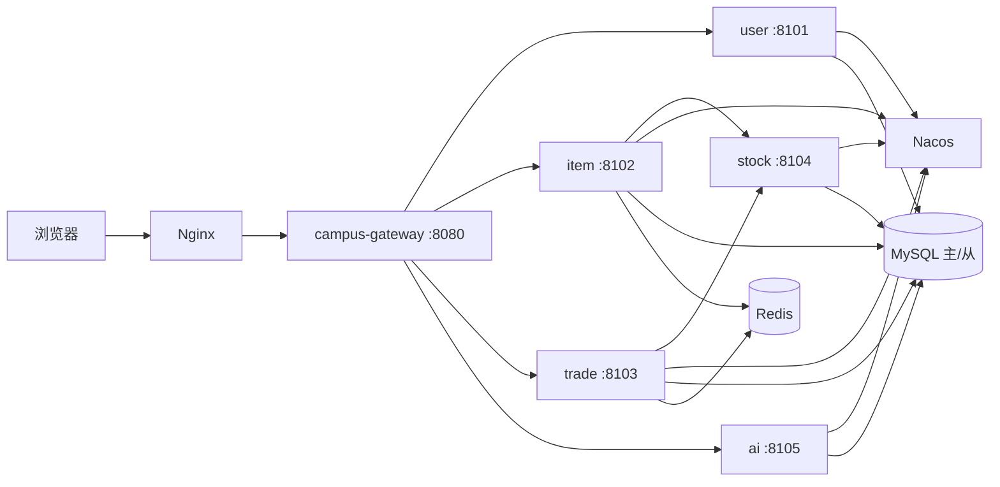

# 拾光校园 · CampusRelife

云南大学软件学院《软件服务工程》课程期末项目 — 校园 C2C 二手交易平台。

买家浏览、收藏与下单，卖家发布闲置并确认成交；网关统一鉴权与限流，交易域分表、物品域主从读写分离，AI 辅助描述/搜索并支持模板降级。

## 功能特性

| 模块 | 能力 |
|------|------|
| 账号 | 学号注册、登录（JWT）、资料与校园认证提交 |
| 物品 | 分类浏览、关键词搜索、发布/上下架、详情 |
| AI | 自然语言搜闲置、一键生成物品描述（无 Key 时模板降级） |
| 交易 | 心愿单、购物车、结算下单、卖家确认、买家收货、取消/超时 |
| 资产 | 积分余额与账本、站内通知 |

**演示主链路：** 注册/登录 → 发布物品 → 浏览/加购 → 结算下单 → 卖家确认 → 买家收货。

> 库内**无预置业务账号**。演示时自行注册两个账号（买卖双方）；分类种子数据已随 MySQL 初始化写入。

## 架构亮点

面向课程验收，重点体现微服务与中间件落地：

| 能力 | 说明 |
|------|------|
| API 网关 | Spring Cloud Gateway：JWT 鉴权、公开路径白名单、滑动窗口限流（如 `/api/categories`） |
| 服务治理 | Nacos 注册发现 + 共享配置（Docker 全栈）；OpenFeign + Resilience4j 熔断/降级 |
| 数据扩展 | Trade：ShardingSphere-JDBC 按 `buyer_id` 分表；Item：MySQL 主从读写分离 |
| 缓存与幂等 | Redis：物品/分类 Cache-Aside；下单幂等结果缓存 |
| 库存 | Stock 服务业务锁（`locked_qty` + 锁定日志），交易 Feign 调用 |
| AI | 可选 OpenAI；失败或关闭时 `AiDegradeService` 模板降级并落库日志 |
| 安全 | 对外 JWT；`/internal/**` 使用 `X-Internal-Token` |



## 技术栈

| 层级 | 技术 |
|------|------|
| 后端 | Spring Boot 4.0、Spring Cloud 2025.1、Gateway、Nacos、OpenFeign、Resilience4j、Redis、ShardingSphere-JDBC 5.5、MyBatis-Plus |
| 前端 | Vue 3、TypeScript、Vite 6、Pinia、Axios、UnoCSS（`campus-web`） |
| 数据 | MySQL 8（主从复制）、Redis 7 |
| 部署 | Docker Compose、Nginx、多阶段 Dockerfile |

## 模块结构

```
relife-master/                 # 本仓库根目录（Maven artifact: campus-relife）
├── campus-common-core/        # ApiResponse、ErrorCode、PageResult
├── campus-common-web/         # 全局异常处理
├── campus-gateway/            # :8080  JWT / 限流 / 路由
├── campus-user-service/       # :8101  campus_user
├── campus-item-service/       # :8102  campus_item（主从读写分离）
├── campus-trade-service/      # :8103  campus_trade（ShardingSphere 分表）
├── campus-stock-service/      # :8104  campus_stock
├── campus-ai-service/         # :8105  campus_ai
├── campus-web/                # Vue3 前端
├── docker/                    # Dockerfile、Nginx、MySQL 初始化、Nacos 配置
├── sql/                       # 5 库 DDL（与 docker init 对应）
└── docs/                      # 设计与运维文档
```

## 文档索引

| 文档 | 说明 |
|------|------|
| [docs/部署手册.md](docs/部署手册.md) | Docker 全栈部署、端口、环境变量、运维 |
| [docs/API接口规范.md](docs/API接口规范.md) | REST 约定、统一响应体、全部对外/内部接口 |
| [docs/数据库设计文档.md](docs/数据库设计文档.md) | 五库表结构、分表与主从、跨服务逻辑关联 |
| [docs/问题日志.md](docs/问题日志.md) | 联调问题根因与修复记录（报告可引用） |

## 环境要求

| 软件 | 版本 | 用途 |
|------|------|------|
| JDK | 21+ | 本地 `spring-boot:run` |
| Maven | 3.9+（项目自带 `mvnw`） | 编译 |
| Docker Desktop | 4.x+，建议开启 BuildKit | 全栈部署 / 本地 MySQL+Redis |
| Node.js | 20+ | 前端 `npm run dev` |

> **路径注意：** 以下命令均在本仓库根目录（`relife-master`）执行，不要在上一级的 `final_project` 执行。

---

## 运行方式概览

| 方式 | 适用场景 | 命令摘要 |
|------|----------|----------|
| **A. Docker 全栈** | 课程验收、报告演示、一键复现 | `docker compose --profile app up -d`（已有镜像）；改代码后加 `--build` |
| **B. 本地开发** | 日常改代码、断点调试 | `docker compose up -d` + 各服务 `spring-boot:run` + `npm run dev` |

---

## 方式 A：Docker 全栈（推荐）

启动 **11 个容器**：MySQL 主库、MySQL 从库、Redis、Nacos、6 个微服务、Nginx（含前端静态资源）。对外统一访问 **http://localhost**。

### A.1 首次部署

```powershell
# 1. 进入项目根目录
cd relife-master

# 2.（可选）复制环境变量，默认即可演示
copy .env.example .env

# 3. 减少 PowerShell 下 Compose 进度刷屏（可选）
$env:COMPOSE_PROGRESS = "plain"

# 4. 开启 BuildKit 并构建启动（首次约 15～30 分钟，视网络与机器而定）
$env:DOCKER_BUILDKIT = 1
docker compose --profile app up -d --build
```

已有镜像、仅重启时可省略 `--build`：

```powershell
docker compose --profile app up -d
```

### A.2 检查是否启动成功

```powershell
docker compose --profile app ps
```

**预期：** 下列容器状态均为 `Up` 且 `healthy`：

| 容器名 | 说明 |
|--------|------|
| `relife-mysql` | 主库 |
| `relife-mysql-slave` | 从库（Item 读写分离） |
| `relife-redis` | 缓存 |
| `relife-nacos` | 注册中心 / 配置中心 |
| `relife-user` / `relife-item` / `relife-trade` / `relife-stock` / `relife-ai` | 业务微服务 |
| `relife-gateway` | API 网关 |
| `relife-nginx` | 前端 + 反代 |

若某服务长时间 `starting` 或 `unhealthy`，先等待 1～2 分钟（MySQL 初始化较慢），再查日志：

```powershell
docker logs relife-gateway --tail 50
docker logs relife-trade --tail 50
docker logs relife-item --tail 50
```

### A.3 访问地址

| 入口 | 地址 |
|------|------|
| **前端（主入口）** | http://localhost |
| API 网关（直连） | http://localhost:8080 |
| Nacos 控制台 | http://localhost:8849/index.html（Nacos 3.x；首次需初始化密码） |
| MySQL | `localhost:3306`（主）/ `3307`（从）；账号 `relife` / `relife123` |
| Redis | `localhost:6379` |

### A.4 快速接口验证

```powershell
# 公开接口（无需登录）
curl.exe http://localhost/api/categories
curl.exe "http://localhost/api/items?page=1&size=5"
```

注册并登录（PowerShell 推荐用 `Invoke-RestMethod`，避免 JSON 转义问题）：

```powershell
# 注册
Invoke-RestMethod -Uri http://localhost/api/auth/register -Method Post `
  -ContentType "application/json" `
  -Body (@{
    campusId   = "2021003999"
    loginName  = "demo01"
    password   = "12345678"
    nickname   = "演示用户"
    contactInfo = "demo01@ynu.edu.cn"
  } | ConvertTo-Json)

# 登录，记下返回的 accessToken
$auth = Invoke-RestMethod -Uri http://localhost/api/auth/login -Method Post `
  -ContentType "application/json" `
  -Body (@{ loginName = "demo01"; password = "12345678" } | ConvertTo-Json)

$token = $auth.data.accessToken
$headers = @{ Authorization = "Bearer $token" }

# 需登录的接口
Invoke-RestMethod -Uri http://localhost/api/cart -Headers $headers
Invoke-RestMethod -Uri "http://localhost/api/notifications?page=1&size=10" -Headers $headers
```

浏览器演示建议注册 **两个账号**（买家 / 卖家），走完整交易链路。

### A.5 常用运维命令

```powershell
# 停止全栈（保留数据库数据）
docker compose --profile app down

# 停止并清空数据卷（重置数据库，慎用）
docker compose --profile app down -v

# 仅重建并重启某个服务（改代码后）
docker compose --profile app up -d --build item-service trade-service

# 实时查看日志
docker logs -f relife-gateway
```

### A.6 全栈故障排查（常见）

| 现象 | 原因与处理 |
|------|------------|
| `docker compose up` 无业务容器 | 未加 `--profile app`；仅 `up` 只启 MySQL+Redis |
| 构建极慢或卡住 | 配置 Docker 镜像加速；确保 `DOCKER_BUILDKIT=1`；可用 `up -d` 后台跑 |
| `3306` / `8080` / `80` 端口占用 | 停本机 MySQL 或旧 `spring-boot:run`：`netstat -ano \| findstr :8080` → `taskkill /PID <pid> /F` |
| Nacos `unhealthy` 导致全栈起不来 | 见 [docs/问题日志.md](docs/问题日志.md) #18–#20 |
| Nacos 8848 端口被占用 | 本机其他 Nacos 容器已占用；先停止冲突容器 |
| 发布物品 503，容器却都 healthy | Feign 误连 `127.0.0.1`；确保使用最新代码重建 `item-service`（见问题日志 #24） |
| 购物车/通知 500 | ShardingSphere 未注册 `cart_entry`/`trade_notify`；重建 `trade-service`（见 #25） |
| 中文分类乱码（仅终端） | PowerShell 编码问题，浏览器/API 正常；可 `chcp 65001` |
| Gateway 限流 429 | 正常；同一 IP 短时间请求过多，等 10 秒或调 `.env` 中 `GATEWAY_RATE_LIMIT` |

更多记录见 [docs/问题日志.md](docs/问题日志.md)、[docs/部署手册.md](docs/部署手册.md)。

---

## 方式 B：本地开发

适合修改 Java/Vue 代码并热重载。基础设施用 Docker，业务服务在宿主机运行。

### B.1 启动基础设施

```powershell
cd relife-master
docker compose up -d
```

仅启动 **MySQL + Redis**（不启 Nacos、不启业务容器）。数据库首次启动会自动执行 `docker/mysql/init/` 下的建库脚本。

账号：`relife` / `relife123`（root：`relife_root`）

### B.2 编译项目

```powershell
.\mvnw.cmd clean install -DskipTests
```

> 不要只对单模块 `spring-boot:run` 而跳过全量 install，否则会报找不到 `campus-common-web` 等兄弟模块。

### B.3 启动后端（每个服务开一个终端）

本地默认 **不启用 Nacos**，微服务通过固定 URL 互调。按顺序或并行启动：

```powershell
.\mvnw.cmd -pl campus-user-service spring-boot:run
.\mvnw.cmd -pl campus-item-service spring-boot:run
.\mvnw.cmd -pl campus-stock-service spring-boot:run
.\mvnw.cmd -pl campus-trade-service spring-boot:run
.\mvnw.cmd -pl campus-ai-service spring-boot:run
.\mvnw.cmd -pl campus-gateway spring-boot:run
```

| 服务 | 端口 | 数据库 |
|------|------|--------|
| Gateway | 8080 | — |
| User | 8101 | campus_user |
| Item | 8102 | campus_item |
| Trade | 8103 | campus_trade |
| Stock | 8104 | campus_stock |
| AI | 8105 | campus_ai |

**端口冲突：** 若报 `Port 810x was already in use`，说明已有实例在跑：

```powershell
netstat -ano | findstr ":8080 :8101 :8102 :8103 :8104 :8105"
taskkill /PID <真实PID> /F
```

也可在 Docker 全栈与本地开发之间切换前执行 `docker compose --profile app down`，避免 8080/3306 冲突。

### B.4 启动前端

```powershell
cd campus-web
npm install
npm run dev
```

浏览器访问 **http://localhost:5173**。Vite 将 `/api` 代理到 Gateway `http://127.0.0.1:8080`（见 `campus-web/vite.config.ts`）。

### B.5 本地开发注意事项

- 各服务 `application.yml` 中 `NACOS_DISCOVERY_ENABLED` 默认为 `false`；Feign URL 默认**留空**（Docker 全栈走 Nacos）。本地多进程调试需自行设置，例如：
  - `ITEM_SERVICE_URL=http://127.0.0.1:8102`
  - `STOCK_SERVICE_URL=http://127.0.0.1:8104`
  - `USER_SERVICE_URL=http://127.0.0.1:8101`
  - `TRADE_SERVICE_URL=http://127.0.0.1:8103`
- **不要**在本地开发时把 Feign URL 留空却不启 Nacos，否则服务发现找不到下游。
- AI 服务默认模板降级（无需 OpenAI Key）；要测 LLM 可设环境变量 `AI_LLM_ENABLED=true` 和 `OPENAI_API_KEY`。
- Trade 服务本地同样使用 ShardingSphere-JDBC；需保证 `campus_trade` 库中 `trade_order_0/_1`、`trade_line_0/_1` 等表已由 init 脚本创建。

### B.6 关键环境变量（可选）

完整说明见 [.env.example](.env.example) 与 [部署手册 §六](docs/部署手册.md)。常用项：

| 变量 | 说明 |
|------|------|
| `JWT_SECRET` | 各服务须一致 |
| `INTERNAL_TOKEN` | Feign 内部调用令牌 |
| `AI_LLM_ENABLED` | 默认 `false`（模板降级，适合演示） |
| `GATEWAY_RATE_LIMIT` | 限流阈值（默认 10 次 / 窗口） |

---

## 演示与验收建议

1. **主链路（浏览器）**：注册买家/卖家两个账号 → 卖家发布 → 买家加购结算 → 卖家确认 → 买家收货 → 查看积分与通知。
2. **公开 API**：`GET /api/categories`、`GET /api/items` 应返回 `code=0`。
3. **治理能力（Docker 内网探针）**：`/internal/**` 不经 Gateway，可在容器网络内验证主从与分表：

```powershell
# Item 读写分离（返回 master/slave 标识）
docker exec relife-item curl -sf "http://127.0.0.1:8102/internal/items/datasource-route" -H "X-Internal-Token: CampusRelifeInternalDevToken2026"

# Trade 分表路由（buyerId % 2）
docker exec relife-trade curl -sf "http://127.0.0.1:8103/internal/trade/shard-route?buyerId=6" -H "X-Internal-Token: CampusRelifeInternalDevToken2026"
```

4. **限流**：短时间内多次请求 `/api/categories`，可观察到 HTTP 429（见 `.env` 中 `GATEWAY_RATE_LIMIT`）。
5. **AI**：前端「AI 搜索 / AI 帮我写」；未配置 Key 时应出现模板降级结果，仍可正常演示。

故障与联调细节见 [docs/问题日志.md](docs/问题日志.md)、[docs/部署手册.md](docs/部署手册.md)。
