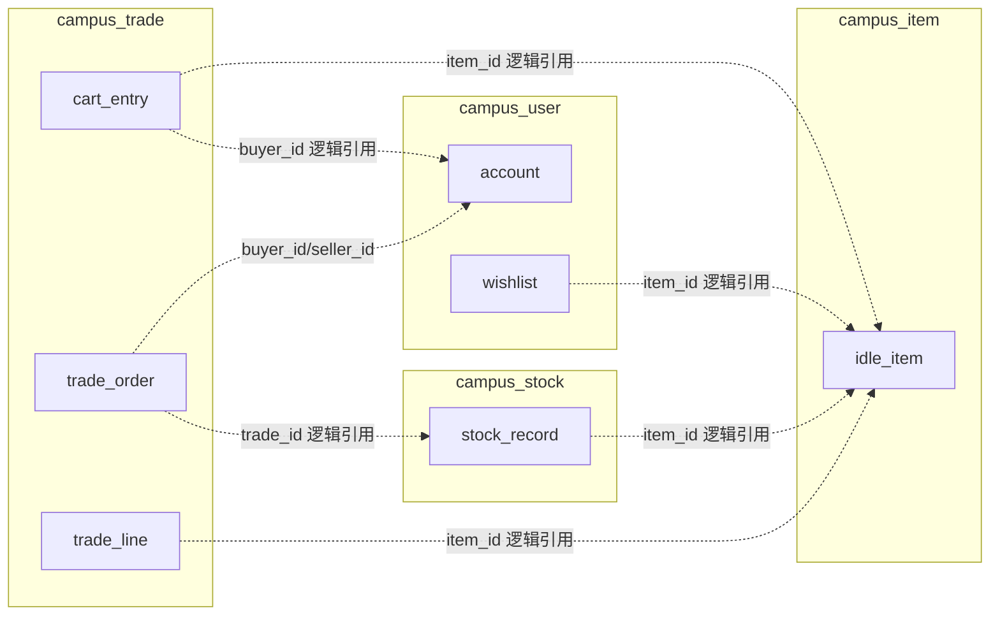
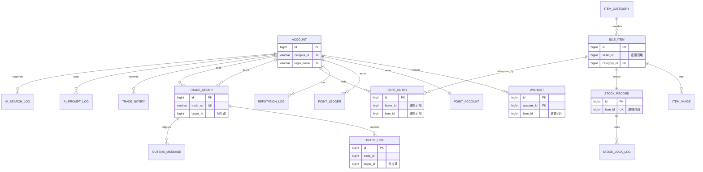
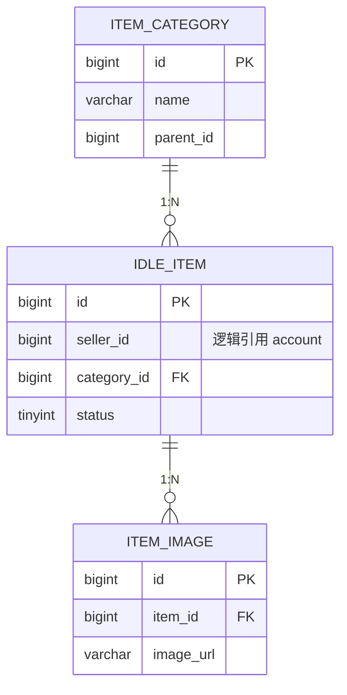
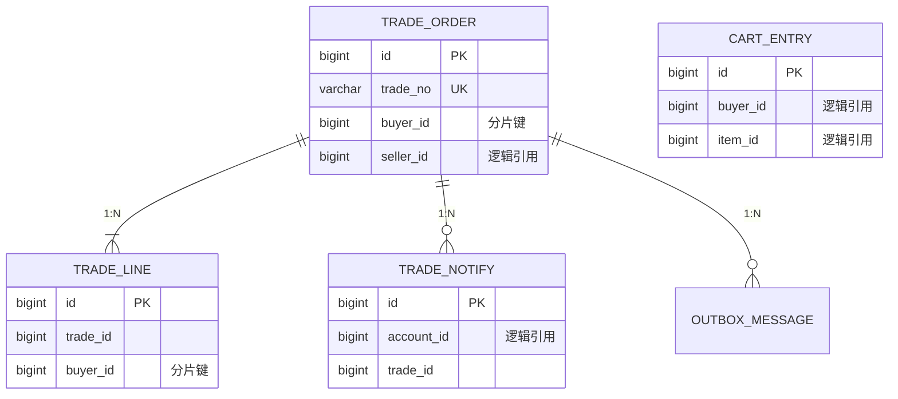
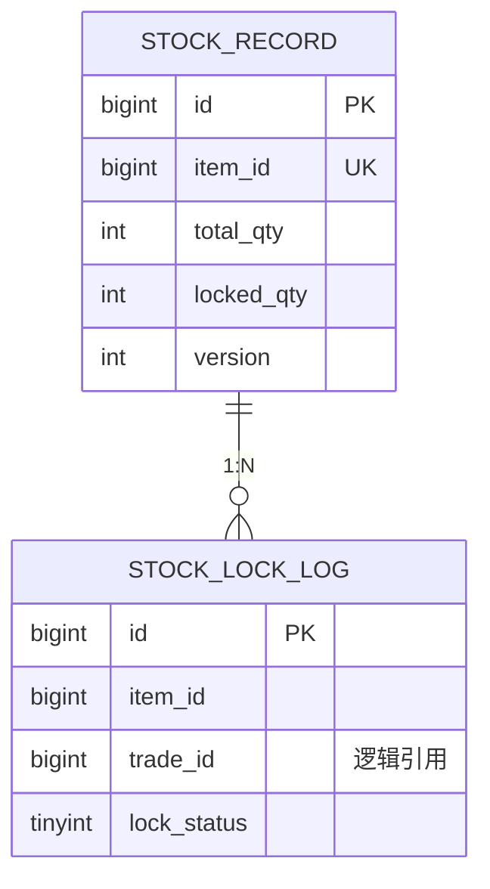
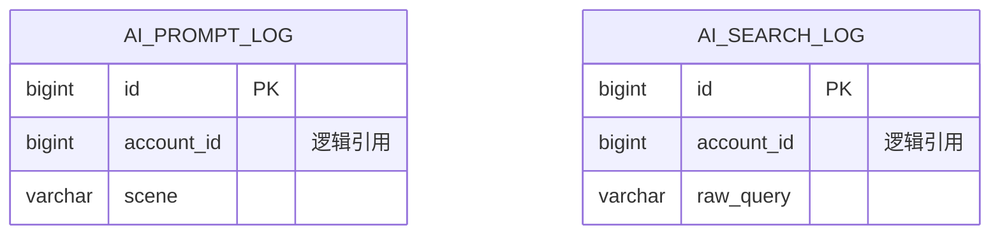

# 拾光校园 · 数据库设计文档

| 属性 | 内容 |
|------|------|
| **文档版本** | v1.1（本科简化版） |
| **修订说明** | 删除 outbox_message；reputation_log 移出 MVP；见简化版文档 |
| **项目代号** | CampusRelife |
| **前置文档** | [PRD v0.3](./PRD-产品需求文档.md) · [系统总体架构 v1.0](./架构设计-系统总体架构.md) |
| **文档状态** | 已落地（5 库表结构已建；分表 ShardingSphere-JDBC、Item 主从已于 Day 12 验收） |
| **数据库引擎** | MySQL 8.0 · InnoDB · utf8mb4 |

---

## 一、设计总则

### 1.1 核心原则

| 原则 | 说明 |
|------|------|
| **一服务一库** | 5 个业务微服务对应 5 个独立逻辑库，Gateway 无库 |
| **库内可建 FK** | 同一数据库内的表允许外键约束 |
| **跨服务仅逻辑引用** | `item_id`、`buyer_id` 等仅为逻辑 ID，**禁止跨库物理外键** |
| **快照冗余** | 订单明细、购物车展示字段冗余存储，避免交易时跨库 JOIN |
| **乐观锁 / 幂等键** | 库存 `version`、积分 `idempotent_key` 保证并发安全 |
| **软删除** | 用户、物品采用 `deleted` 标记，保留审计能力 |

### 1.2 数据库与服务映射

| 逻辑库 | 微服务 | 表数量 | 特殊策略 |
|--------|--------|--------|----------|
| `campus_user` | campus-user-service | 5 | 单库 |
| `campus_item` | campus-item-service | 3 | **MySQL 主从读写分离** |
| `campus_trade` | campus-trade-service | 5 | **ShardingSphere 分表** |
| `campus_stock` | campus-stock-service | 2 | 单库 + Redis 锁 |
| `campus_ai` | campus-ai-service | 2 | 单库 |

### 1.3 跨服务逻辑关联（非物理外键）



> 虚线表示逻辑关联，由应用层 / Feign 保证一致性，**数据库层不建立跨库约束**。

---

## 二、全局 ER 图（逻辑模型）



---

## 三、campus_user 库

### 3.1 ER 图

```mermaid
erDiagram
    ACCOUNT ||--o{ WISHLIST : "1:N"
    ACCOUNT ||--|| POINT_ACCOUNT : "1:1"
    ACCOUNT ||--o{ POINT_LEDGER : "1:N"

    ACCOUNT {
        bigint id PK
        varchar campus_id UK
        varchar login_name UK
        tinyint role
        tinyint cert_status
        int reputation
    }
    WISHLIST {
        bigint id PK
        bigint account_id FK
        bigint item_id
    }
    POINT_ACCOUNT {
        bigint id PK
        bigint account_id FK_UK
        int balance
    }
    POINT_LEDGER {
        bigint id PK
        bigint account_id FK
        varchar idempotent_key UK
    }
```

> `reputation` 字段保留在 `account` 表；`reputation_log` 信誉流水表为**扩展功能**，MVP 不建。

| 表名 | 说明 |
|------|------|
| `account` | 校园账号（含管理员角色） |
| `wishlist` | 收藏 |
| `point_account` | 积分账户 |
| `point_ledger` | 积分流水 |

---

### 3.2.1 account — 校园账号

| 字段 | 类型 | 空 | 默认 | 说明 |
|------|------|----|------|------|
| `id` | BIGINT UNSIGNED | N | AUTO | **主键** |
| `campus_id` | VARCHAR(32) | N | — | 学号/工号，校园认证标识 |
| `login_name` | VARCHAR(64) | N | — | 登录名（邮箱或手机号） |
| `password_hash` | VARCHAR(128) | N | — | BCrypt 密码哈希 |
| `nickname` | VARCHAR(64) | N | '' | 昵称 |
| `contact_info` | VARCHAR(128) | N | '' | 联系方式（下单必填） |
| `avatar_url` | VARCHAR(512) | Y | NULL | 头像地址 |
| `role` | TINYINT | N | 0 | 0=普通用户 1=管理员 |
| `cert_status` | TINYINT | N | 0 | 0=未认证 1=已认证 |
| `reputation` | INT | N | 0 | 信誉分 |
| `status` | TINYINT | N | 0 | 0=正常 1=锁定 2=注销 |
| `deleted` | TINYINT | N | 0 | 0=未删 1=已删 |
| `created_at` | DATETIME | N | CURRENT_TIMESTAMP | 创建时间 |
| `updated_at` | DATETIME | N | CURRENT_TIMESTAMP ON UPDATE | 更新时间 |

**主键：** `PRIMARY KEY (id)`

**唯一索引：**

| 索引名 | 字段 | 说明 |
|--------|------|------|
| `uk_campus_id` | `campus_id` | 学号唯一 |
| `uk_login_name` | `login_name` | 登录名唯一 |

**普通索引：**

| 索引名 | 字段 | 说明 |
|--------|------|------|
| `idx_status_deleted` | `status, deleted` | 管理后台筛选 |

**外键：** 无（根表）

---

### 3.2.2 wishlist — 收藏

| 字段 | 类型 | 空 | 默认 | 说明 |
|------|------|----|------|------|
| `id` | BIGINT UNSIGNED | N | AUTO | **主键** |
| `account_id` | BIGINT UNSIGNED | N | — | 用户 ID，**库内 FK → account.id** |
| `item_id` | BIGINT UNSIGNED | N | — | 物品 ID，**逻辑引用 item 库，无物理 FK** |
| `created_at` | DATETIME | N | CURRENT_TIMESTAMP | 收藏时间 |

**主键：** `PRIMARY KEY (id)`

**唯一索引：**

| 索引名 | 字段 | 说明 |
|--------|------|------|
| `uk_account_item` | `account_id, item_id` | 同一物品不可重复收藏 |

**普通索引：**

| 索引名 | 字段 | 说明 |
|--------|------|------|
| `idx_account_created` | `account_id, created_at DESC` | 我的收藏列表 |

**外键：**

| 约束名 | 字段 | 引用 |
|--------|------|------|
| `fk_wishlist_account` | `account_id` | `account(id)` ON DELETE CASCADE |

---

### 3.2.3 point_account — 积分账户

| 字段 | 类型 | 空 | 默认 | 说明 |
|------|------|----|------|------|
| `id` | BIGINT UNSIGNED | N | AUTO | **主键** |
| `account_id` | BIGINT UNSIGNED | N | — | 用户 ID，**库内 FK** |
| `balance` | INT | N | 0 | 当前积分余额 |
| `updated_at` | DATETIME | N | CURRENT_TIMESTAMP ON UPDATE | 更新时间 |

**主键：** `PRIMARY KEY (id)`

**唯一索引：** `uk_account_id (account_id)` — 一人一账户

**外键：** `fk_point_account (account_id) → account(id)`

---

### 3.2.4 point_ledger — 积分流水

| 字段 | 类型 | 空 | 默认 | 说明 |
|------|------|----|------|------|
| `id` | BIGINT UNSIGNED | N | AUTO | **主键** |
| `account_id` | BIGINT UNSIGNED | N | — | 用户 ID，**库内 FK** |
| `trade_id` | BIGINT UNSIGNED | Y | NULL | 关联交易 ID，**逻辑引用 trade 库** |
| `change_amount` | INT | N | — | 变动值（正=增加，负=扣减） |
| `balance_after` | INT | N | — | 变动后余额 |
| `rule_code` | VARCHAR(32) | N | — | 规则码：`TRADE_BUYER` / `TRADE_SELLER` / `REDEEM` |
| `idempotent_key` | VARCHAR(64) | N | — | 幂等键，如 `{tradeId}_{ruleCode}` |
| `remark` | VARCHAR(256) | N | '' | 备注 |
| `created_at` | DATETIME | N | CURRENT_TIMESTAMP | 创建时间 |

**主键：** `PRIMARY KEY (id)`

**唯一索引：** `uk_idempotent_key (idempotent_key)` — 防重复发积分

**普通索引：**

| 索引名 | 字段 | 说明 |
|--------|------|------|
| `idx_account_created` | `account_id, created_at DESC` | 积分明细列表 |
| `idx_trade_id` | `trade_id` | 按交易查流水 |

**外键：** `fk_point_ledger_account (account_id) → account(id)`

---

## 四、campus_item 库

### 4.1 ER 图



### 4.2 表清单

| 表名 | 说明 |
|------|------|
| `item_category` | 物品分类 |
| `idle_item` | 闲置物品主表 |
| `item_image` | 物品图片 |

---

### 4.2.1 item_category — 物品分类

| 字段 | 类型 | 空 | 默认 | 说明 |
|------|------|----|------|------|
| `id` | BIGINT UNSIGNED | N | AUTO | **主键** |
| `name` | VARCHAR(64) | N | — | 分类名称 |
| `parent_id` | BIGINT UNSIGNED | N | 0 | 父分类 ID，0=顶级 |
| `sort_order` | INT | N | 0 | 排序权重 |
| `status` | TINYINT | N | 1 | 0=禁用 1=启用 |
| `created_at` | DATETIME | N | CURRENT_TIMESTAMP | 创建时间 |

**主键：** `PRIMARY KEY (id)`

**普通索引：** `idx_parent_sort (parent_id, sort_order)`

**外键：** 无（`parent_id` 自引用，不建 FK 便于迁移）

---

### 4.2.2 idle_item — 闲置物品

| 字段 | 类型 | 空 | 默认 | 说明 |
|------|------|----|------|------|
| `id` | BIGINT UNSIGNED | N | AUTO | **主键** |
| `seller_id` | BIGINT UNSIGNED | N | — | 卖家 ID，**逻辑引用 account，无物理 FK** |
| `category_id` | BIGINT UNSIGNED | N | — | 分类 ID，**库内 FK** |
| `title` | VARCHAR(128) | N | — | 标题 |
| `summary` | VARCHAR(512) | N | '' | 摘要（列表展示） |
| `description` | TEXT | Y | NULL | 详细描述 |
| `condition_level` | TINYINT | N | 3 | 成色：1~5（5=全新） |
| `original_price` | DECIMAL(10,2) | N | 0.00 | 原价 |
| `sale_price` | DECIMAL(10,2) | N | 0.00 | 售价 |
| `status` | TINYINT | N | 0 | 0=草稿 1=在售 2=已售 3=下架 |
| `view_count` | INT UNSIGNED | N | 0 | 浏览次数 |
| `published_at` | DATETIME | Y | NULL | 上架时间 |
| `deleted` | TINYINT | N | 0 | 软删除 |
| `created_at` | DATETIME | N | CURRENT_TIMESTAMP | 创建时间 |
| `updated_at` | DATETIME | N | CURRENT_TIMESTAMP ON UPDATE | 更新时间 |

**主键：** `PRIMARY KEY (id)`

**普通索引：**

| 索引名 | 字段 | 说明 |
|--------|------|------|
| `idx_category_status` | `category_id, status, deleted` | 分类列表 |
| `idx_seller_status` | `seller_id, status, deleted` | 我的发布 |
| `idx_status_published` | `status, published_at DESC` | 最新发布 |
| `idx_title` | `title` | 关键词搜索（FULLTEXT 可选） |

**全文索引（可选）：** `FULLTEXT idx_ft_title_summary (title, summary)` — 关键词搜索

**外键：** `fk_item_category (category_id) → item_category(id)`

---

### 4.2.3 item_image — 物品图片

| 字段 | 类型 | 空 | 默认 | 说明 |
|------|------|----|------|------|
| `id` | BIGINT UNSIGNED | N | AUTO | **主键** |
| `item_id` | BIGINT UNSIGNED | N | — | 物品 ID，**库内 FK** |
| `image_url` | VARCHAR(512) | N | — | 图片 URL |
| `sort_order` | INT | N | 0 | 排序 |
| `is_cover` | TINYINT | N | 0 | 1=封面图 |
| `created_at` | DATETIME | N | CURRENT_TIMESTAMP | 创建时间 |

**主键：** `PRIMARY KEY (id)`

**普通索引：** `idx_item_sort (item_id, sort_order)`

**外键：** `fk_image_item (item_id) → idle_item(id) ON DELETE CASCADE`

---

## 五、campus_trade 库

### 5.1 ER 图



### 5.2 表清单

| 表名 | 说明 | 分片 |
|------|------|------|
| `cart_entry` | 购物车 | ❌ 不分片（数据量小） |
| `trade_order` | 交易主单 | ✅ **按 buyer_id 分表** |
| `trade_line` | 交易明细快照 | ✅ **按 buyer_id 分表** |
| `trade_notify` | 站内通知 | ❌ 不分片 |

---

### 5.2.5 ~~outbox_message~~（已删除）

> **本科简化版已删除本地消息表。** 积分改由 Trade 在「确认收货」时**同步 Feign** 调 User 服务发放，靠 `point_ledger.idempotent_key` 防重复。

---

### 5.2.1 cart_entry — 购物车

| 字段 | 类型 | 空 | 默认 | 说明 |
|------|------|----|------|------|
| `id` | BIGINT UNSIGNED | N | AUTO | **主键** |
| `buyer_id` | BIGINT UNSIGNED | N | — | 买家 ID，**逻辑引用 account** |
| `item_id` | BIGINT UNSIGNED | N | — | 物品 ID，**逻辑引用 idle_item** |
| `quantity` | INT UNSIGNED | N | 1 | 数量（C2C 通常为 1） |
| `item_title` | VARCHAR(128) | N | '' | 冗余：物品标题 |
| `item_price` | DECIMAL(10,2) | N | 0.00 | 冗余：加入时售价 |
| `item_cover` | VARCHAR(512) | N | '' | 冗余：封面图 |
| `created_at` | DATETIME | N | CURRENT_TIMESTAMP | 加购时间 |
| `updated_at` | DATETIME | N | CURRENT_TIMESTAMP ON UPDATE | 更新时间 |

**主键：** `PRIMARY KEY (id)`

**唯一索引：** `uk_buyer_item (buyer_id, item_id)` — 同一物品一条记录

**普通索引：** `idx_buyer_updated (buyer_id, updated_at DESC)`

**外键：** 无（跨服务字段不建 FK）

**设计说明：** 冗余 `item_title/price/cover` 借鉴 newbee-mall 购物车展示字段，避免列表页 Feign 批量查 Item。

---

### 5.2.2 trade_order — 交易主单 ⭐ 分片表

| 字段 | 类型 | 空 | 默认 | 说明 |
|------|------|----|------|------|
| `id` | BIGINT UNSIGNED | N | AUTO | **主键**（全局唯一，可用雪花 ID） |
| `trade_no` | VARCHAR(32) | N | — | 交易单号，业务唯一 |
| `buyer_id` | BIGINT UNSIGNED | N | — | 买家 ID，**分片键** |
| `seller_id` | BIGINT UNSIGNED | N | — | 卖家 ID，**逻辑引用** |
| `total_amount` | DECIMAL(10,2) | N | 0.00 | 订单总金额 |
| `status` | TINYINT | N | 0 | 0=待确认 1=已确认 2=已完成 3=已取消 4=已超时 |
| `buyer_contact` | VARCHAR(128) | N | '' | 快照：买家联系方式 |
| `cancel_reason` | VARCHAR(256) | N | '' | 取消原因 |
| `confirmed_at` | DATETIME | Y | NULL | 卖家确认时间 |
| `completed_at` | DATETIME | Y | NULL | 完成时间 |
| `expired_at` | DATETIME | Y | NULL | 超时时间 |
| `created_at` | DATETIME | N | CURRENT_TIMESTAMP | 创建时间 |
| `updated_at` | DATETIME | N | CURRENT_TIMESTAMP ON UPDATE | 更新时间 |

**主键：** `PRIMARY KEY (id)`

**唯一索引：** `uk_trade_no (trade_no)`

**普通索引：**

| 索引名 | 字段 | 说明 |
|--------|------|------|
| `idx_buyer_status_created` | `buyer_id, status, created_at DESC` | 我买到的 |
| `idx_seller_status_created` | `seller_id, status, created_at DESC` | 我卖出的 |
| `idx_status_created` | `status, created_at` | 超时关单扫描 |

**外键：** 无

**分片配置：**

```yaml
# ShardingSphere 分表规则（设计说明，非部署代码）
actualDataNodes: campus_trade.trade_order_${0..1}
shardingColumn: buyer_id
algorithm: buyer_id % 2
```

物理表：`trade_order_0`、`trade_order_1`

---

### 5.2.3 trade_line — 交易明细快照 ⭐ 分片表

| 字段 | 类型 | 空 | 默认 | 说明 |
|------|------|----|------|------|
| `id` | BIGINT UNSIGNED | N | AUTO | **主键** |
| `trade_id` | BIGINT UNSIGNED | N | — | 交易单 ID，**同库关联，不建 FK**（分片表） |
| `trade_no` | VARCHAR(32) | N | — | 交易单号冗余 |
| `buyer_id` | BIGINT UNSIGNED | N | — | 买家 ID，**分片键**（与主单一致） |
| `item_id` | BIGINT UNSIGNED | N | — | 物品 ID，**逻辑引用** |
| `seller_id` | BIGINT UNSIGNED | N | — | 卖家 ID，**逻辑引用** |
| `item_title` | VARCHAR(128) | N | — | 快照：标题 |
| `item_cover` | VARCHAR(512) | N | '' | 快照：封面 |
| `unit_price` | DECIMAL(10,2) | N | — | 快照：单价 |
| `quantity` | INT UNSIGNED | N | 1 | 快照：数量 |
| `line_amount` | DECIMAL(10,2) | N | — | 快照：行金额 |
| `created_at` | DATETIME | N | CURRENT_TIMESTAMP | 创建时间 |

**主键：** `PRIMARY KEY (id)`

**普通索引：**

| 索引名 | 字段 | 说明 |
|--------|------|------|
| `idx_trade_id` | `trade_id` | 按单查明细 |
| `idx_buyer_created` | `buyer_id, created_at DESC` | 分片路由 |

**外键：** 无（分片表不与主单建 FK，应用层保证一致性）

**设计说明：** 借鉴 newbee-mall `order_item` 快照模式，物品下架/改价后订单展示不变。

**分片：** 与 `trade_order` 相同，按 `buyer_id % 2` → `trade_line_0` / `trade_line_1`

---

### 5.2.4 trade_notify — 站内通知

| 字段 | 类型 | 空 | 默认 | 说明 |
|------|------|----|------|------|
| `id` | BIGINT UNSIGNED | N | AUTO | **主键** |
| `account_id` | BIGINT UNSIGNED | N | — | 接收人，**逻辑引用 account** |
| `trade_id` | BIGINT UNSIGNED | Y | NULL | 关联交易 |
| `trade_no` | VARCHAR(32) | N | '' | 交易单号 |
| `notify_type` | VARCHAR(32) | N | — | `ORDER_CREATED` / `ORDER_CONFIRMED` / `ORDER_COMPLETED` |
| `title` | VARCHAR(128) | N | — | 通知标题 |
| `content` | VARCHAR(512) | N | '' | 通知内容 |
| `is_read` | TINYINT | N | 0 | 0=未读 1=已读 |
| `created_at` | DATETIME | N | CURRENT_TIMESTAMP | 创建时间 |

**主键：** `PRIMARY KEY (id)`

**普通索引：** `idx_account_read_created (account_id, is_read, created_at DESC)`

**外键：** 无

---

## 六、campus_stock 库

### 6.1 ER 图



### 6.2 表清单

| 表名 | 说明 |
|------|------|
| `stock_record` | 物品库存主记录 |
| `stock_lock_log` | 库存锁定流水 |

---

### 6.2.1 stock_record — 库存主记录

| 字段 | 类型 | 空 | 默认 | 说明 |
|------|------|----|------|------|
| `id` | BIGINT UNSIGNED | N | AUTO | **主键** |
| `item_id` | BIGINT UNSIGNED | N | — | 物品 ID，**逻辑引用，一物品一条** |
| `total_qty` | INT UNSIGNED | N | 1 | 总库存（C2C 默认 1） |
| `locked_qty` | INT UNSIGNED | N | 0 | 已锁定数量 |
| `available_qty` | INT UNSIGNED | N | 1 | 可售数量（= total - locked） |
| `version` | INT UNSIGNED | N | 0 | 乐观锁版本号 |
| `updated_at` | DATETIME | N | CURRENT_TIMESTAMP ON UPDATE | 更新时间 |

**主键：** `PRIMARY KEY (id)`

**唯一索引：** `uk_item_id (item_id)` — 一物一库存记录

**外键：** 无（`item_id` 跨服务）

**设计说明：** 借鉴 newbee-mall `stock_num`，独立为库存域；`version` 配合 `UPDATE ... WHERE version=?` 防并发超卖。

---

### 6.2.2 stock_lock_log — 库存锁定流水

| 字段 | 类型 | 空 | 默认 | 说明 |
|------|------|----|------|------|
| `id` | BIGINT UNSIGNED | N | AUTO | **主键** |
| `item_id` | BIGINT UNSIGNED | N | — | 物品 ID |
| `trade_id` | BIGINT UNSIGNED | N | — | 交易 ID，**逻辑引用** |
| `trade_no` | VARCHAR(32) | N | — | 交易单号 |
| `lock_qty` | INT UNSIGNED | N | 1 | 锁定数量 |
| `lock_status` | TINYINT | N | 1 | 1=锁定中 2=已释放 |
| `created_at` | DATETIME | N | CURRENT_TIMESTAMP | 锁定时间 |
| `released_at` | DATETIME | Y | NULL | 释放时间 |

**主键：** `PRIMARY KEY (id)`

**普通索引：**

| 索引名 | 字段 | 说明 |
|--------|------|------|
| `idx_item_status` | `item_id, lock_status` | 查物品锁定状态 |
| `idx_trade_id` | `trade_id` | 按交易释放 |
| `uk_trade_item` | `trade_id, item_id` | 幂等：一交易一物品一条锁定记录 |

**外键：** 无

---

## 七、campus_ai 库

### 7.1 ER 图



### 7.2 表清单

| 表名 | 说明 |
|------|------|
| `ai_prompt_log` | AI 描述生成调用日志 |
| `ai_search_log` | AI 语义搜索调用日志 |

---

### 7.2.1 ai_prompt_log — AI 描述生成日志

| 字段 | 类型 | 空 | 默认 | 说明 |
|------|------|----|------|------|
| `id` | BIGINT UNSIGNED | N | AUTO | **主键** |
| `account_id` | BIGINT UNSIGNED | Y | NULL | 用户 ID，**逻辑引用** |
| `scene` | VARCHAR(32) | N | `DESCRIBE` | 场景码 |
| `input_json` | JSON | N | — | 输入参数 |
| `output_json` | JSON | Y | NULL | AI 输出 |
| `model_name` | VARCHAR(64) | N | — | 模型名称 |
| `latency_ms` | INT | N | 0 | 耗时毫秒 |
| `status` | TINYINT | N | 1 | 0=失败 1=成功 2=降级 |
| `created_at` | DATETIME | N | CURRENT_TIMESTAMP | 创建时间 |

**主键：** `PRIMARY KEY (id)`

**普通索引：** `idx_account_created (account_id, created_at DESC)`

**外键：** 无

---

### 7.2.2 ai_search_log — AI 语义搜索日志

| 字段 | 类型 | 空 | 默认 | 说明 |
|------|------|----|------|------|
| `id` | BIGINT UNSIGNED | N | AUTO | **主键** |
| `account_id` | BIGINT UNSIGNED | Y | NULL | 用户 ID，**逻辑引用** |
| `raw_query` | VARCHAR(512) | N | — | 用户原始输入 |
| `parsed_json` | JSON | Y | NULL | AI 解析后的结构化条件 |
| `result_count` | INT | N | 0 | 命中物品数 |
| `latency_ms` | INT | N | 0 | 耗时 |
| `created_at` | DATETIME | N | CURRENT_TIMESTAMP | 创建时间 |

**主键：** `PRIMARY KEY (id)`

**普通索引：** `idx_created (created_at DESC)` — 运营分析

**外键：** 无

---

## 八、表结构汇总

| 库 | 表 | 行数预估（演示） | 物理 FK | 逻辑跨库字段 |
|----|-----|------------------|---------|--------------|
| campus_user | account | 百级 | — | — |
| campus_user | wishlist | 千级 | account_id | item_id |
| campus_user | point_account | 百级 | account_id | — |
| campus_user | point_ledger | 千级 | account_id | trade_id |
| campus_item | item_category | 十级 | — | — |
| campus_item | idle_item | 千级 | category_id | seller_id |
| campus_item | item_image | 千级 | item_id | — |
| campus_trade | cart_entry | 百级 | — | buyer_id, item_id |
| campus_trade | trade_order | 千级×分片 | — | buyer_id, seller_id |
| campus_trade | trade_line | 千级×分片 | — | item_id, seller_id |
| campus_trade | trade_notify | 千级 | — | account_id, trade_id |
| campus_stock | stock_record | =物品数 | — | item_id |
| campus_stock | stock_lock_log | 千级 | — | item_id, trade_id |
| campus_ai | ai_prompt_log | 百级 | — | account_id |
| campus_ai | ai_search_log | 百级 | — | account_id |

**合计：5 库 · 16 张表**

---

## 九、设计说明：为什么这样设计

### 9.1 为什么用户与积分/收藏同库

收藏、积分、信誉都围绕 `account_id` 展开，查询路径是「我的收藏」「我的积分」，与用户强绑定。合并到 `campus_user` 可避免 User 服务为查积分再 Feign 自己。

### 9.2 为什么购物车与订单同库

下单流程是「读购物车 → 写订单 → 删购物车」，在一个服务内可用**本地事务**完成，无需跨库。借鉴 newbee-mall 购物车与订单同单体的好处，在微服务边界内复现。

### 9.3 为什么库存独立成库

库存锁定是并发敏感操作，独立库 + Redis 锁 + 乐观锁，故障域与 Item、Trade 隔离。Item 服务只关心「物品信息」，Stock 关心「能不能卖」。

### 9.4 为什么 trade_line 做快照

若只存 `item_id`，物品改价/下架后历史订单展示会失真。借鉴 newbee-mall `order_item` 快照，交易时把标题、价格、图片写入 `trade_line`。

### 9.5 为什么 cart_entry 冗余物品字段

购物车列表是高频读，若每次查 Cart 都 Feign Item，延迟与耦合度高。加购时写入冗余字段，与 newbee-mall 购物车内嵌商品信息同理。

### 9.6 为什么积分用同步 Feign 而不是 Outbox

Trade 确认收货时**同步** Feign 调 User 发积分，配合 `point_ledger.idempotent_key` 防重复。本科课程项目优先保证**流程简单、团队能讲清楚**；Outbox/MQ 作为报告中的扩展方向，本次不实现。

### 9.7 为什么跨服务不建物理外键

微服务数据库独立部署，物理 FK 会导致：
- 无法独立迁移、扩容
- 跨库级联删除风险
- 服务边界被 DB 绑死

逻辑引用 + 应用层校验 + 快照冗余是微服务数据设计标准做法。

---

## 十、ShardingSphere 分片设计

### 10.1 适合分片的表

| 表 | 是否分片 | 分片键 | 物理表 | 理由 |
|----|----------|--------|--------|------|
| `trade_order` | ✅ **是** | `buyer_id` | `trade_order_0` ~ `_1` | 订单随用户增长，买家维度查询最多 |
| `trade_line` | ✅ **是** | `buyer_id` | `trade_line_0` ~ `_1` | 与主单同路由，避免跨片 JOIN |
| `cart_entry` | ❌ 否 | — | — | 数据量小，每用户几条 |
| `trade_notify` | ❌ 否 | — | — | 可按 account 索引，演示期单表够用 |

### 10.2 不适合分片的库/表

| 库/表 | 原因 |
|-------|------|
| campus_user 全表 | 用户量校园级，单表足够 |
| campus_item 全表 | 物品千级，主从即可 |
| campus_stock 全表 | 与物品 1:1，数据量小 |
| campus_ai 全表 | 日志型，写多读少 |

### 10.3 分片路由规则

```
buyer_id % 2 == 0  →  trade_order_0 / trade_line_0
buyer_id % 2 == 1  →  trade_order_1 / trade_line_1
```

**查询路由：**

| 场景 | 路由 |
|------|------|
| 我的买入（按 buyer_id） | 单片，高效 |
| 我的卖出（按 seller_id） | **全片扫描**（演示可接受；生产可加 seller 索引表） |
| 按 trade_no 查询 | 广播路由或 Redis 缓存 trade_no→buyer_id |

**课程演示建议：** 分 2 表即可，报告中附 ShardingSphere 配置与 `buyer_id` 路由原理说明。

### 10.4 主键与分片

- `trade_order.id` 建议使用**雪花算法**全局唯一，避免分表 AUTO_INCREMENT 冲突
- `trade_no` 业务唯一，与分片键无关

---

## 十一、Redis 缓存设计（按业务）

### 11.1 需要缓存的业务

| 业务 | 缓存 Key | 数据来源表 | TTL | 原因 |
|------|----------|------------|-----|------|
| 物品详情 | `item:detail:{id}` | idle_item + item_image | 10 min | 详情页高频读，读多写少 |
| 分类列表 | `item:categories` | item_category | 30 min | 几乎不变，首页每次加载 |
| 最新发布列表 | `item:latest:p{page}` | idle_item | 5 min | 首页热点，减轻 DB |
| 物品列表（按分类） | `item:list:cat{id}:p{page}` | idle_item | 5 min | 浏览为主 |
| 用户信息 | `user:info:{id}` | account | 15 min | Trade 校验用户时减少查库 |
| 用户积分余额 | `user:points:{id}` | point_account | 5 min | 个人中心展示 |
| AI 描述结果 | `ai:desc:{inputHash}` | — | 1 h | 相同输入复用，省 LLM 费用 |
| 下单幂等 | `trade:idempotent:{token}` | — | 5 min | 防重复提交，不写 DB |
| 库存分布式锁 | `stock:lock:{itemId}` | — | 30 s | 锁定原子性，配合 stock_record |
| trade_no 路由 | `trade:route:{tradeNo}` | trade_order | 30 min | 分片后按单号查 buyer_id |
| JWT 黑名单 | `auth:blacklist:{jti}` | — | token 剩余 | 登出失效 |
| Gateway 限流 | `gw:rate:{ip}:{path}` | — | 1 min | 服务治理演示 |

### 11.2 不需要缓存的业务

| 业务 | 原因 |
|------|------|
| 购物车读写 | 强一致，数据随用户变化快 |
| 交易下单写链路 | 写多读少，缓存意义不大 |
| 库存可售数量 | 必须准实时，直接读 `stock_record` + 锁 |
| 积分流水写入 | 账务数据，以 DB 为准 |
| outbox_message | 定时任务扫库，缓存无收益 |

### 11.3 缓存更新策略

| 事件 | 操作 |
|------|------|
| 物品更新/下架 | 删除 `item:detail:{id}` 及相关列表 Key |
| 物品发布 | 删除 `item:latest:*` |
| 用户改资料 | 删除 `user:info:{id}` |
| 积分变动 | 删除 `user:points:{id}` |
| 分类变更 | 删除 `item:categories` |

---

## 十二、MySQL 主从读写分离

### 12.1 适合主从的库

| 库 | 是否主从 | 说明 |
|----|----------|------|
| **campus_item** | ✅ **是** | 读多写少，浏览/搜索/详情占绝大多数流量 |
| campus_user | ❌ 否 | 登录写 JWT 场景多，读写均衡，单库即可 |
| campus_trade | ❌ 否 | 写链路敏感，主从延迟可能导致结算异常 |
| campus_stock | ❌ 否 | 强一致，必须读主库 |
| campus_ai | ❌ 否 | 日志写入为主，无读压力 |

### 12.2 campus_item 主从路由

| 操作 | 路由 | 涉及表 |
|------|------|--------|
| 发布/编辑/上下架物品 | **主库** | idle_item, item_image |
| 物品详情查询 | **从库**（ miss 则缓存） | idle_item, item_image |
| 列表/搜索/分类页 | **从库** | idle_item, item_category |
| 分类管理（管理员） | **主库** | item_category |

### 12.3 主从部署说明

```
relife-mysql（主）:3306  ──复制──→  relife-mysql-slave（从）:3307
         ↑                                      ↑
    Item 服务写                            Item 服务读
```

**注意：** 上架后立即浏览可能读到从库延迟，可通过「写后删缓存」+「详情短 TTL」缓解，课程演示足够。

### 12.4 不适合主从的场景总结

| 场景 | 原因 |
|------|------|
| 库存锁定 | 必须读最新 available_qty |
| 下单事务 | 购物车删除与写单需同一主库事务 |
| 积分发放 | 账务不能容忍主从延迟 |
| 分片表 trade_order | 已用 ShardingSphere，与主从叠加复杂度过高 |

---

## 十三、索引设计原则小结

| 原则 | 示例 |
|------|------|
| 唯一约束保业务 | `uk_account_item`、`uk_trade_no`、`uk_idempotent_key` |
| 查询条件建联合索引 | `idx_buyer_status_created` 覆盖「我的订单」 |
| 分片键入索引 | `buyer_id` 置于联合索引最左 |
| 跨服务字段仅普通索引 | `item_id`、`seller_id` 不加 FK |
| 软删除纳入索引 | `status, deleted` 组合过滤 |

---

## 十四、后续文档

| 文档 | 状态 |
|------|------|
| PRD v0.3 | ✅ |
| 系统总体架构 v1.0 | ✅ |
| 数据库设计 v1.1 | ✅ 本文档 |
| API 接口规范 v1.1 | ✅ 已完成 |
| DDL 初始化脚本 | ✅ `sql/` + `docker/mysql/init/` |

